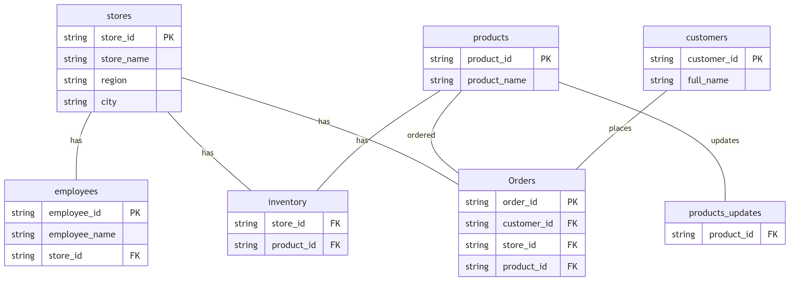

# retail-data-engineering
This repository demonstrates a full-stack data engineering workflow for a hybrid retail business (ecommerce + physical stores), focusing on mock data generation, data transformation, and cloud-native orchestration using Azure services.

## mock-data-plan

Generating mock data for below tables using pyspark, Will data quality noises which we are going to clean later in the project
| **stores**        | **employees**       | **products**        | **products_updates** | **customers**        | **inventory**         | **Orders**             |
|--------------------|----------------------|----------------------|-----------------------|-----------------------|------------------------|-------------------------|
| store_id           | employee_id          | product_id           | brand                 | customer_id           | store_id              | order_id               |
| store_name         | employee_name        | product_name         | category              | full_name             | product_id            | timestamp              |
| region             | store_id             | brand                | created_at            | email                 | on_hand               | value                  |
| city               | role                 | category             | currency              | phone                 | unit_cost             | event_ts               |
| is_active          | monthly_salary       | unit_cost            | event_type            | birth_date            | snapshot_ts           | customer_id            |
| last_updated       | is_active            | list_price           | is_active             | country_code          |                        | store_id               |
| created_at         | last_updated         | currency             | last_updated          | preferred_currency    |                        | product_id             |
| ingestion_date     | hire_date            | is_active            | list_price            | is_active             |                        | unit_price             |
|                    | termination_date     | last_updated         | product_id            | last_updated          |                        | quantity               |
|                    | ingestion_date       | created_at           | product_name          | created_at            |                        | currency               |
|                    |                      | ingestion_date       | unit_cost             | ingestion_date        |                        | gross_amount           |
|                    |                      |                      |                       |                       |                        | event_time_str         |
|                    |                      |                      |                       |                       |                        | ingestion_date         |

## Relationship Diagram

